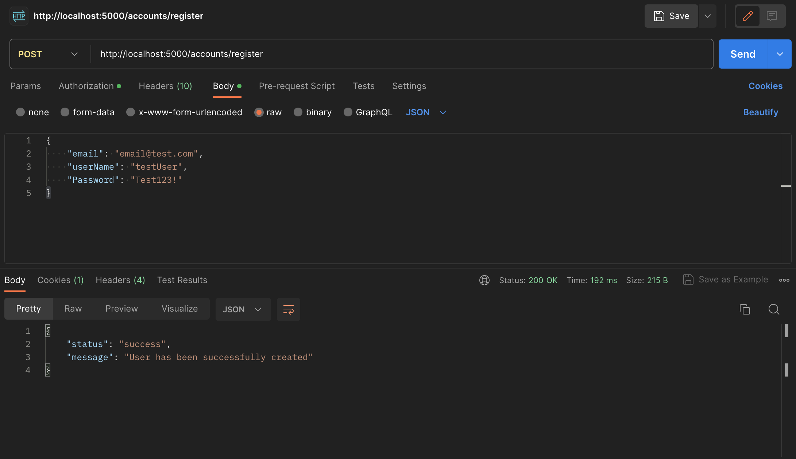
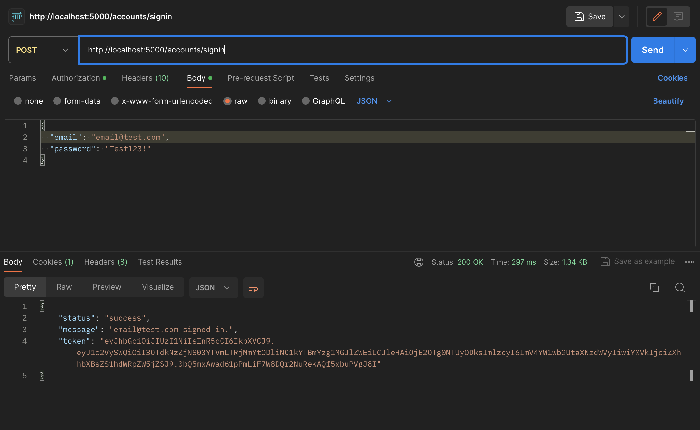
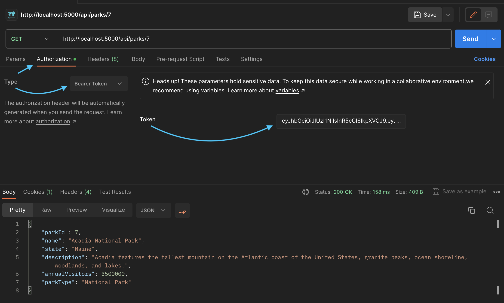

# National Parks

## About
This application is designed for the exploration and interaction with various API endpoints related to national parks. Whether a park enthusiast or just curious about natural wonders, this application offers the capability to access, search, retrieve, and update information from a comprehensive database of national parks across the United States.

## Technologies Used
* _Github_
* _VSCode_
* _C#_
* _.NET_
* _CSHTML_
* _JSON_
* _MySQL Workbench_
* _Swagger_
* _Postman_

------------------------------

## Prerequisites

* _MySQL_
* _MySQL Workbench_
* _Entity Framework Core_
* _Postman_

#### Install MySQL Workbench
 [MySQL Workbench](https://dev.mysql.com/downloads/workbench/).

#### Install Postman
(Optional) [Postman](https://www.postman.com/downloads/).

------------------------------

## Application Setup

1. Clone this repo.
2. Open the terminal and navigate to this project's production directory called "NationalParks".
3. Within the production directory "NationalParks", create two new files: `appsettings.json` and `appsettings.Development.json`.
4. Within `appsettings.json`, add the following code:

```json
{
  "Logging": {
    "LogLevel": {
      "Default": "Information",
      "Microsoft.AspNetCore": "Warning"
    }
  },
  "AllowedHosts": "*",
  "ConnectionStrings": {
    "DefaultConnection": "Server=localhost;Port=3306;database={YOUR_DATABASE};uid={USERNAME};pwd={PASSWORD};"
  },
   "JWT": {
      "ValidAudience": "example-audience",
      "ValidIssuer": "example-issuer",
      "Secret": "{SECRET}"
}
}
```
  > Make sure to replace the `database`, `uid`, and `pwd` values in the MySQL database connection string with your choice of database name, your own username, and password for MySQL. For the `Secret` key, make sure to replace `{SECRET}` with a string of your choice, at least 16 characters long.
  
  _As per `JWT`_

  > "Let's quickly breakdown what this object is. The ValidAudience key of our object is indicating who we are intending to distribute our JWT Tokens to, the ValidIssuer indicates who are the ones creating the tokens, and the Secret is a special string that will be used to encode our JWTs, to make them unique to our application. Depending on what type of algorithm being used, the Secret string will need to be a certain length. In this case, it needs to be at least 16 characters long." - [Calvin Will](https://github.com/CalvinPVIII/asp.net-webapi-auth-guide) 

5. Within `appsettings.Development.json`, add the following code:

```json
{
  "Logging": {
    "LogLevel": {
      "Default": "Information",
      "Microsoft": "Trace",
      "Microsoft.AspNetCore": "Information",
      "Microsoft.Hosting.Lifetime": "Information"
    }
  }
}
```

6. Open your shell (e.g., Terminal or GitBash) to the production directory "NationalParks", and run `dotnet ef database update`.
    > To optionally create a migration, run the command `dotnet ef migrations add MigrationName` where `MigrationName` is your custom name for the migration in UpperCamelCase. 
7. To further build out this project in development mode, start the project with `dotnet watch run` in the production directory "NationalParks".
8. Use your program of choice to make API calls. The upcoming examples will be using Postman. In your API calls, use the domain _http://localhost:5000_. Keep reading to learn about all of the available endpoints.

------------------------------

## 🛰️ API Documentation
Explore the API endpoints in Postman or a browser.

### Using Swagger Documentation 
To explore National Parks with NSwag, launch the project using `dotnet run` with the Terminal or Powershell, and input the following URL into your browser: 
```
http://localhost:5000/swagger
```
## Generating a JSON Web Token
In order to be authorized to use the `POST`, `PUT`, and `DELETE` functionality of the API, you are required to authenticate yourself through Postman with a JSON Web Token (JWT). All `GET` functionality will work for users and non-users, respectively.

------------------------------

> ### Registration
In Postman, create a `POST` request using the following URL: 
```
http://localhost:5000/accounts/register
```

Add the following query to the request as raw JSON data in the Body tab:
```json
{
  "email": "email@test.com",
  "userName": "testUser",
  "password": "Test123!"
}
```

*If you would like to customize your password, please ensure that your password has: *1 uppercase letter, 1 lowercase letter, 1 number, 1 special character, and is at least 6 characters long*.

> ### Expected JSON Response
```json
{
  "status": "success",
  "message": "User has been successfully created"
}
```

<html>


------------------------------

> ### Authentication
With your newly created account, create another `POST` request, this time using the following URL: 
```
http://localhost:5000/accounts/signin
```

Add the following query to the request as raw JSON data in the Body tab:
```json
{
  "email": "email@test.com",
  "password": "Test123!"
}
```
> ### Expected JSON Response
```json
{
  "status": "success",
  "message": "email@test.com signed in",
  "token": "{yourGeneratedToken}"
}
```

<html>


------------------------------

> ### Using the JSON Web Token

* Copy `{yourGeneratedToken}` from the response Body 
* Click on the 'Authorization' tab 
* Adjacent to 'Type' will be a drowndown menu, click on the menu and select 'Bearer Token'
* Within the Body, paste `{yourGeneratedToken}` in the empty form field adjacent to 'Token'

    > You now have full access to National Parks. 

<html>


------------------------------

### Available Endpoints

`GET` http://localhost:5000/api/parks/

`GET` http://localhost:5000/api/parks/{id}

`GET` http://localhost:5000/api/parks/random

`GET` http://localhost:5000/api/parks/search

`POST`http://localhost:5000/api/parks/

`PUT` http://localhost:5000/api/parks/{id}

`DELETE` http://localhost:5000/api/parks/{id}

**Note**: `{id}` should be replaced with the id value of the park you want to `GET`, `PUT`, `POST` or `DELETE`.

------------------------------

#### Optional Query Parameters for `GET` Request

| Parameter   | Type        |   Description |
| ----------- | ----------- |  -----------  |
| name        | String      | Returns park(s) with a matching name value |
| state       | String      | Returns park(s) with matching state value |
| description | String      | Returns park(s) with matching description |
| annualVisitors | Int      | Returns park(s) with matching amount of annual visitors |
| parkType    | String      | Returns park(s) with matching park type; National Park or State Park |


#### Example `GET` Query

```
http://localhost:5000/api/parks?name=Joshua+Tree+National+Park
```

**Note**: You should replace spaces between objects with a `+` in the query parameter, for instance, Joshua Tree National Park should be represented as `Joshua+Tree+National+Park`.

#### Expected JSON Response

```json
[
  {
    "parkId": 3,
    "name": "Joshua Tree National Park",
    "state": "California",
    "description": "Joshua Tree is famous for its unique desert landscapes and iconic Joshua trees.",
    "annualVisitors": 3000000,
    "parkType": "National Park"
  }
]
```

#### Example `POST` Query

```
http://localhost:5000/api/parks
```

Customize or use the following query as an example to the request as raw JSON data in the Body tab:
```json
{
  "name": "ParkName",
  "state": "ParkState",
  "description": "ParkDescription",
  "annualVisitors": 0,
  "parkType": "ParkType"

}
```

**Note**: You do not need to add the key for `parkId`, a `POST` request implicitly generates a new `parkId` value.

#### Expected JSON Response
```json
{
  "parkId": 13,
  "name": "ParkName",
  "state": "ParkState",
  "description": "ParkDescription",
  "annualVisitors": 0,
  "parkType": "National Park"

}
```

#### Example `PUT` Query
```
http://localhost:5000/api/parks/1
```
Customize or use the following query as an example to the request as raw JSON data in the Body tab:
```json
{
  "parkId": 1,
  "name": "ParkName",
  "state": "ParkState",
  "description": "ParkDescription",
  "annualVisitors": 0,
  "parkType": "ParkType"

}
```

##### Original Value for `parkId`: `1`
```json
{
  "parkId": 1,
  "name": "Yosemite National Park",
  "state": "California",
  "description": "Yosemite is known for its waterfalls, deep valleys, grand meadows, and ancient giant sequoias.",
  "annualVisitors": 4000000,
  "parkType": "National Park"

}
```

After sending a valid `PUT` request, you should see a successful status code in the response Body:

`Status: 204 No Content`

Now to further test the `PUT` query's success, send a `GET` request to the following URL: 

```
http://localhost:5000/api/parks/1
```

#### Expected JSON Response
```json
{
  "parkId": 1,
  "name": "ParkName",
  "state": "ParkState",
  "description": "ParkDescription",
  "annualVisitors": 0,
  "parkType": "ParkType"

}
```

#### Example `DELETE` Query
```
http://localhost:5000/api/parks/1
```

**Note**: You do not need to add anything in the Body to send a `DELETE` request, simply specify the route with a valid `{id}`, in our case, `1`, and if successful, just like from our `PUT` request example, should appear a `Status: 204 No Content` in the response Body.

Now to further test the `DELETE` query's success, send a `GET` request to the following URL: 
```
http://localhost:5000/api/parks/1
```

#### Expected JSON Response
`Status: 404 Not Found`
  > Indicative that the object was successfully deleted.
```json
{
  "type": "https://tools.ietf.org/html/rfc7231#section-6.5.4",
  "title": "Not Found",
  "status": 404,
  "traceId": "00-dc5177f4587a2c3017e8d7673889c47d-8a1f1bed21d52b95-00"
}
```

#### Example `GET` Search Query
```
http://localhost:5000/api/parks/search?annualVisitors=800000
```
**Note**: To customize your query, add a query parameter to the URL. In this case, we're using `annualVisitors` to filter parks based on their annual visitors count. You can replace `800000` with another desired value or alternatively, by using different query parameters and values, you can tailor your queries to search for parks that meet specific criteria. For instance, you could change `annualVisitors` to `state` with a value of `California`, `name` with a value of `Redwood`, or `parkType` with a value of `National+Park` to search for parks by `state`, `name`, or `type`, respectively. 

#### Expected JSON Response
```json
[
  {
    "parkId": 4,
    "name": "Redwood National and State Parks",
    "state": "California",
    "description": "Home to the tallest trees on Earth, the coastal redwoods.",
    "annualVisitors": 800000,
    "parkType": "National Park"

  }
]
```

#### Additional `GET` Search Example
```
http://localhost:5000/api/parks/search?state=oregon
```

#### Expected JSON Response
```json
[
  {
    "parkId": 6,
    "name": "Silver State Falls",
    "state": "Oregon",
    "description": "Silver State Falls is a beautiful park featuring stunning waterfalls, lush forests, and hiking trails.",
    "annualVisitors": 500000,
    "parkType": "State Park"

  }
]
```
#### Example `GET` Random Query
```
http://localhost:5000/api/parks/random
```
This endpoint will simply generate a single randomized park result each time a request is sent.

------------------------------

### Pagination
National Parks returns a default of 6 results per page at a time for a `GET` request with the following URL:
```
http://localhost:5000/api/parks/
```
To modify this, use the query parameters `page` and `pageSize` and replace `{customize}` with integer values where `pageSize` is the amount of objects to be viewed.

```
http://localhost:5000/api/parks?page={customize}&pageSize={customize}
```

------------------------------

### ⚖️ License

This project is licensed under the [MIT License](https://opensource.org/licenses/MIT). Copyright (C) 2023 Jeremy Josol. All Rights Reserved.

```
MIT License

Copyright (c) 2023 Jeremy Josol.

Permission is hereby granted, free of charge, to any person obtaining a copy
of this software and associated documentation files (the "Software"), to deal
in the Software without restriction, including without limitation the rights
to use, copy, modify, merge, publish, distribute, sublicense, and/or sell
copies of the Software, and to permit persons to whom the Software is
furnished to do so, subject to the following conditions:

The above copyright notice and this permission notice shall be included in all
copies or substantial portions of the Software.

THE SOFTWARE IS PROVIDED "AS IS", WITHOUT WARRANTY OF ANY KIND, EXPRESS OR
IMPLIED, INCLUDING BUT NOT LIMITED TO THE WARRANTIES OF MERCHANTABILITY,
FITNESS FOR A PARTICULAR PURPOSE AND NONINFRINGEMENT. IN NO EVENT SHALL THE
AUTHORS OR COPYRIGHT HOLDERS BE LIABLE FOR ANY CLAIM, DAMAGES OR OTHER
LIABILITY, WHETHER IN AN ACTION OF CONTRACT, TORT OR OTHERWISE, ARISING FROM,
OUT OF OR IN CONNECTION WITH THE SOFTWARE OR THE USE OR OTHER DEALINGS IN THE
SOFTWARE.
```